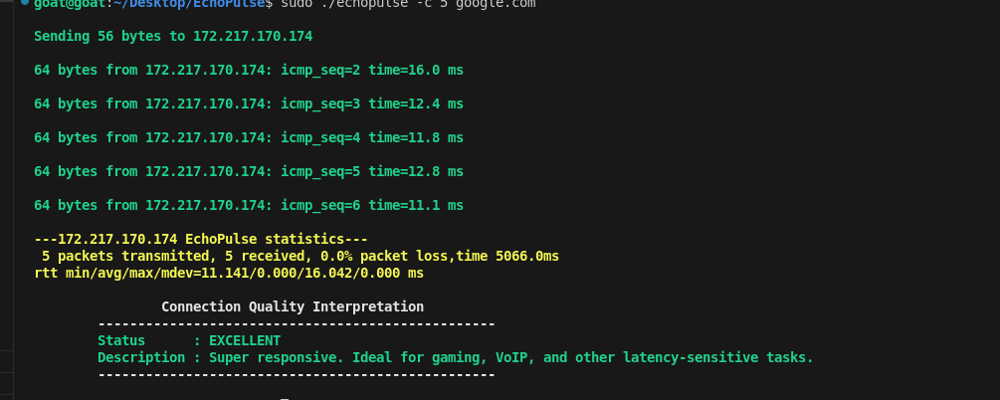
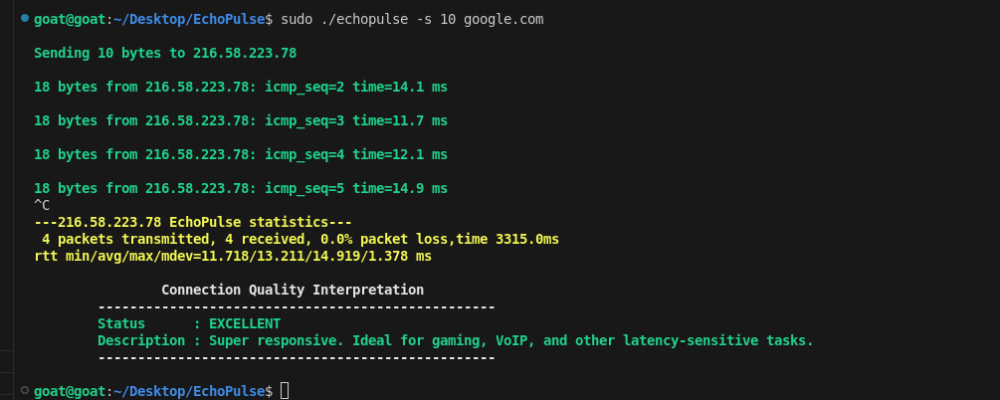
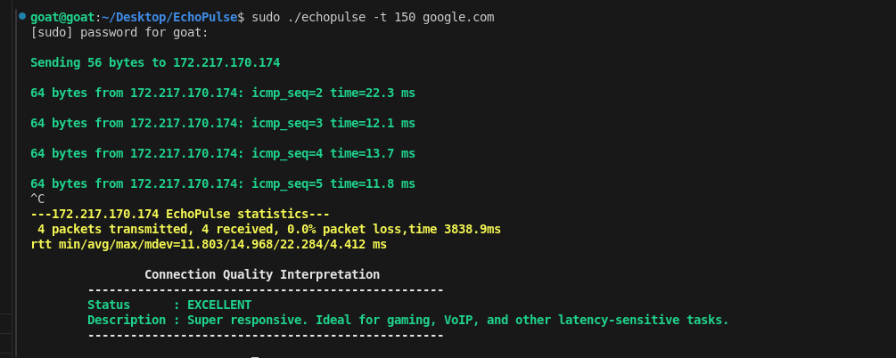
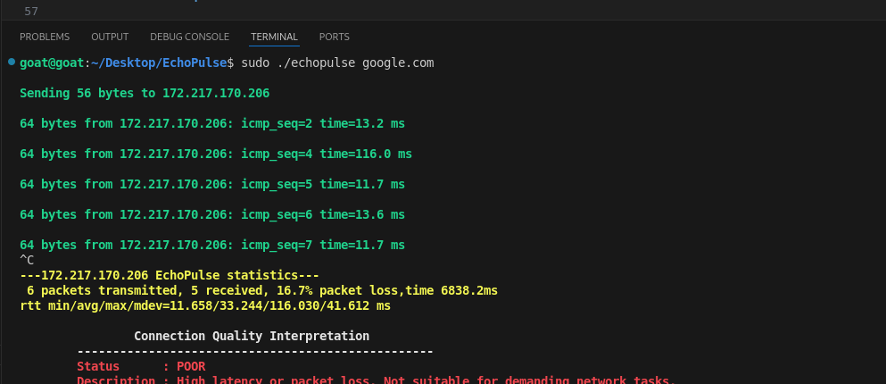
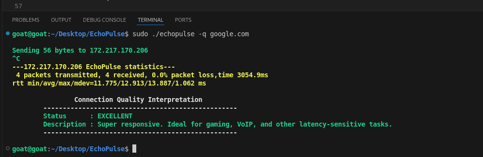
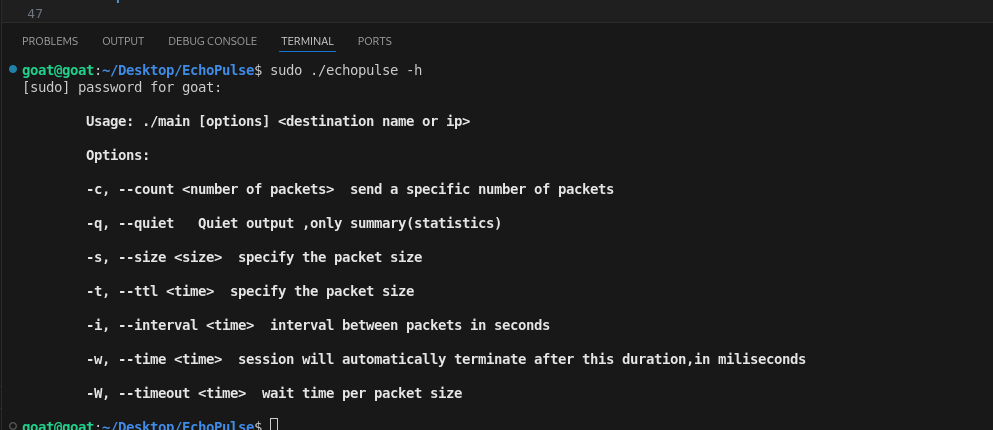
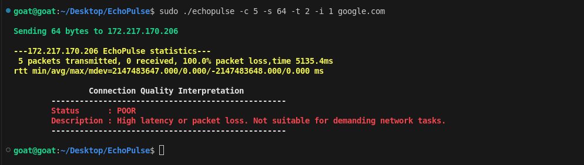
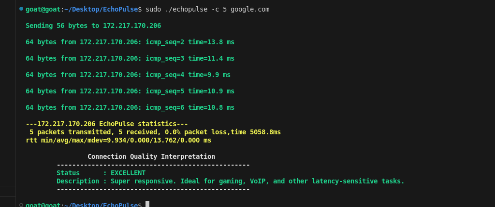

# EchoPulse

**EchoPulse** is a modern and extensible ICMP ping utility written in C that leverages raw sockets to craft and send custom ICMP Echo Request packets, analyze responses, and provide detailed round-trip time (RTT) statistics and connection quality assessments. It's a powerful alternative to the traditional `ping`, offering greater control and detailed diagnostics.

---

## Features

- Raw socket packet crafting (ICMP and IP headers)
- Precise RTT calculation and summary statistics
- Custom payload size, TTL, timeout, and interval control
- Connection quality interpretation (Excellent/Good/Moderate/Poor)
- Quiet mode for scripts and summary reporting
- Handles `SIGINT` (Ctrl+C) to print final stats when run indefinitely
- Graceful timeout handling with descriptive ICMP error decoding
- Requires **root privileges** (due to raw socket usage)

---

##  Build Instructions

Ensure you have a GCC-compatible compiler.

```bash
make all

```
This will compile the **echopulse** executable.

**Usage**

Run EchoPulse with root privileges to enable raw socket operations:  
sudo ./echopulse [options] \<destination\>


**options**:  
-c \<count\>	      Number of echo requests to send (default: unlimited)  
   

-s \<size\>	      Payload size in bytes (default: 56)  
   
-t \<timeout\>	   Timeout in seconds to wait for each reply (default: 1)   
-i \<interval\>	   Interval in seconds between packets (default: 1)  
-t \<time in seconds\>	      Time-to-live value for outgoing packets (default: 64)  
   
-q	      Quiet mode, only print summary statistics  

**without quiet option:**  

  

**with quiet option:**  

  

-h	      Display help and usage information  

  


**Example**

Ping google.com 5 times with 64-byte payloads, 2-second timeout, and 1-second interval:
```bash  
sudo ./echopulse -c 5 -s 64 -t 2 -i 1 google.com

```

### Screenshot Example

Here’s a sample output of EchoPulse in action:




**Connection Quality Interpretation**

EchoPulse interprets connection quality based on RTT and packet loss:  
*Quality	Description*  
Excellent	RTT < 50ms and packet loss < 1%  
Good	RTT < 100ms and packet loss < 3%  
Moderate	RTT < 200ms or packet loss < 5%  
Poor	RTT ≥ 200ms or packet loss ≥ 5%  




## Future Plans

EchoPulse is actively being improved. Here are some features planned for future releases:

- [ ] **Multi-host support**: Send ICMP Echo Requests to multiple hosts in parallel or sequentially and report results.
- [ ] **Subnet sweep**: Automatically detect and ping all live hosts in a given subnet (e.g., `192.168.1.0/24`), useful for network discovery.


*Contributions*

Contributions, issues, and feature requests are welcome! Feel free to fork the repo and submit pull requests.

*Contact*
Created by Your Lucas Onyiego — feel free to reach out at lucasonyiego283@gmail.com

## License

This project is licensed under the [MIT License](LICENSE).